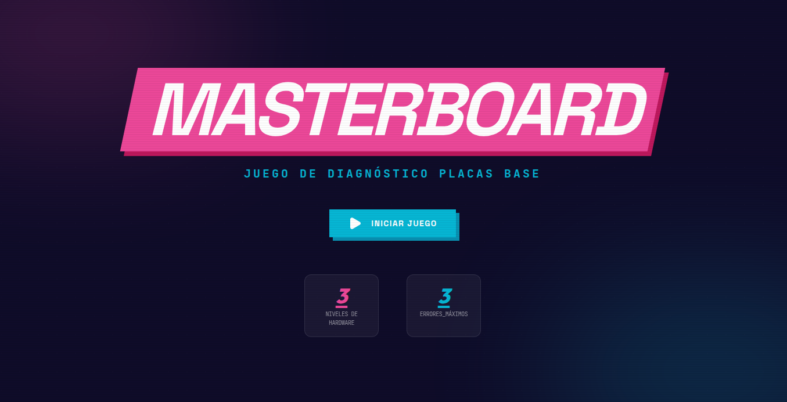
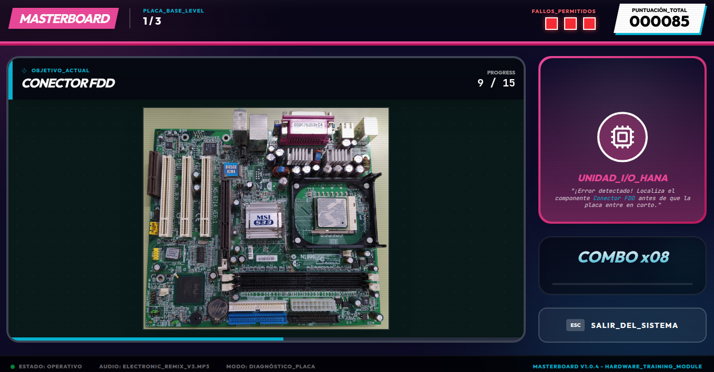

# 🖥️ Masterboard

## 📌 Descripción

Este proyecto consiste en un **juego de identificación de componentes en placas base** 
diseñado para fines educativos. 

---

## 🎯 Objetivos

* Facilitar el aprendizaje de componentes de placa base

---

## ▶️ Uso

Simplemente haz clic en este enlace: [https://bmedinayanez.github.io/masterboard].

---

## 🧠 Tecnologías utilizadas

* Lenguaje: REACT+VITE, JavaScript, HTML, CSS
* Plataforma de desarrollo: Google AI Studio

---

## 👨‍🏫 Autor

Desarrollado por **Mª Beatriz Medina Yañez** con ayuda de Google AI Studio

---

## 🖼️ Screenshots

